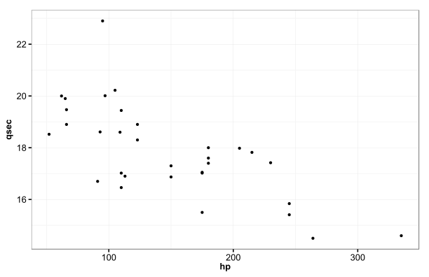

## The Problem of Data Visualization

- Data use is increasing rapidly within the education space
- Policymakers are under increasing pressure to use data to inform decisions, justify funding, and guide practice
- **But,** policymakers are often **not** statisticians, researchers, or quants
- **Data visualization** is a way to bridge this gap
- Proper data visualization will bring the data to the audience in a way they can understand quickly and use to inform decisions

---

## Follow Along

### http://www.myurl.com/presentation


--- &twocol w1:50% w2:50%

## What is dataviz?

***left
### Dataviz is...
>- An exploratory tool for understanding datasets
>- A communication tool for framing decisions and depicting problems
>- A way to showcase 
>- A better way to present results of analyses

***right
### Dataviz is not...
>- Easy
>- A replacement for analysis
>- Infographics
>- Easy!


--- quote

<p><q>Data visualization is a tool for communicating <span class = 'red'>a specific feature</span> of a datset in an approachable and efficient manner</q></p>

--- quote

<p><q>If a picture is worth a thousand words, a good data visualization must always be <span class = 'red'>better than a table.</span></q></p>

---

## Student Growth

<p align="center"></p>

---

## Objectives

1. Review data visualization principles and chart types
2. Look at applications in education data from an SEA
3. Challenges with administrative data and policymaking
4. Best practices and advice
5. What tools to use
6. Activity!


--- plot

## Example

How can we improve this simple scatterplot?




--- &twocol w1:20% w2:80%

## Principles

*** left
- Elements of a chart
- Chart Types and Data Types
- Dimensionality
- Scale
- Complexity
- Technical details
- Beyond charts

*** right


---

## Chart Elements

There are a few things that all charts need. There are sometimes strong cases to deviate from these, but they are good rules of thumb. 

- **Axis labels** and a **title**
  * These make the chart self-explanatory
- A **legend**
  * What is the unit in the graphic?
- A **scale**
  * How are units mapped to the visual space
- **Annotations**
  * Author and data source (depending on distribution)

---

## Dimensions

- Charts and data are made up of dimensions (e.g. a bar chart is *x* and *y*)
- Additional dimensions can be represented by additional aesthetics or chart elements (e.g. color, size, shape, etc.)
- Dimensions can also be shown by multiple plots (e.g. a filmstrip)
- **Smart use of dimensions allows us to increase the information density of our charts**


--- quote

<p><q> How you turn dimensions in the <span class = 'red'>data</span> into visual cues for your audience is everything.</q></p>

--- quote

## Reviewing Chart Types

---

## Stacked Bar

<p align="center"></p>

--- 

## Box and Whisker

<p align="center"></p>

---

## Bullet Chart

<p align="center"></p>

---

## Calendar

<p align="center"></p>

---

## Lines

<p align="center"></p>

---

## Parallel Coordinates

<p align="center"></p>

---

## Parallel Sets

<p align="center"></p>

---

## Tree Map

<p align="center"></p>

---

## Word Cloud

<p align="center"></p>

---

## Data Types

- Any given dimension may be measured at different [levels of measure](http://en.wikipedia.org/wiki/Level_of_measurement) [derived by Stanley Smith Stevens in the 1940s and 50s]
  * Nominal: unordered categories of data (e.g. race)
  * Ordinal: ordered categories of data, relative size and degree of difference between categories is unknown (e.g. Likert scales, proficiency levels perhaps)
  * Interval: ordered categories of data, fixed width, like discrete temperature scales (e.g. grade in school)
  * Continuous (ratio): a measurement scale in a continuous space with a meaningful zero - physical measurements (e.g. scale scores)

---

## Mapping Levels of Measure to Visual Cues

### Aesthetics for Mapping

How do we map levels of measurement onto visual features of charts?

Aesthetic |      Discrete              |  Continuous
----------|  ------------------------- | -------------------------------
Color     |  Disparate colors          |  Sequential or divergent colors
Size      |  Unique size for each value|   mapping to radius of value
Shape     |  A shape for each value    |   **does not make sense**

### Ordered vs. Unordered

Aesthetic  |    Ordered                         |  Unordered
---------- |  --------------------------------  |   -------------------------
Color      |  Sequential or divergent colors  |    Rainbow
Size       |  Increasing or decreasing radius |    **does not make sense**
Shape      |  **does not make sense**         |    A shape for each value


--- plot

## Example


--- quote

<p><q> Think like a <span class = 'red'>map</span>. Data density and easy interpretability.</q></p>

--- map

## Maps

<p align="center"></p>

---

## Some tips

- Focus on the content
- Use best practices
- Understand the limitations
- Experiment and iterate!

--- 

## Examples


--- plot

## Charting Categorical Data


--- 

## Charting Ordinal Data


---

## Charting Interval/Continuous Data


---

## Complexity

How do we display a ton of data--tens or hundreds of thousands of observations--with combinations of data types across multiple dimensions?

1. **Summarize the data**
  * Display summary statistics visually depicting the central tendency and spread of data
2. **Plot the raw data**
  * Annotate wisely to display the main message
3. **Model the data**
  * Use a statistical model to summarize features of the data

Let's look at some examples of this. 

--- 

## Summarizing Data

- The most simple summaries are measures of central tendency, most easily understood
- It is important to look at the spread of data too though
- If time is of interest, we are interested in trends
- If space is of interest, we are interested in maps or spatial distributions
- **Think about context and reference**
- Let's look at an example summarizing student data to schools!

---

## Plotting Means

Here is a simple plot of mean school reading scores:


But, what's wrong with this plot?

--- &twocol w1:20% w2:80%

## Mistakes

*** left

>- No sense of scale
>- Means can be skewed
>- Simple means are not meaningful
>- With assessment scores we need to know grade distribution
>- Let's try to improve this

*** right


---

## Adding a Dimension


--- 

## Even More Dimensions


---

## Annotation

We still aren't sure what the mean scale score means. Let's see a couple more additions that can make this useful. 


---

## Raw Data

Sometimes, we can get away with showing the raw data, that is, all data points. We may want to do this for a few reasons:

- the "wow" effect, 
- because it is easier, 
- or because it looks better aesthetically. 

How could it be done?

---

## 600,000 Observations Too Many


---

## Spread the Data Out

- Without reducing the data points we need to do three things to be successful

1. **Spread the data out**
  * These points overlap each other and make a mess
2. **Reduce the ink**
  * Each point has too much "weight"
3. **Add Reference Points**
  * 600,000 observations in one panel is not meaningful

>- Edward Tufte and others recommend **small multiples**, a technique of repeating a plot across groups to compare relationships in multiple dimensions 

---

## What About This


---

## Even Smaller Multiples


---

## Binning Data


--- quote

## Modeling the Data

<p><q> All models are <span class = 'red'>wrong</span>. Some models are useful.</q></p>

---

## Smoothers 


---

## Machine Learning

<p align="center"></p>


--- 

## Regression Trees

<p align="center"></p>

---

## Regression Results

<p align="center"></p>

---

## Path Diagrams

<p align="center"></p>

---

## Illustrating a Model

<p align="center"></p>

---

## Combining Features

We can combine these features. 

>- Facets with smoother lines for references (small multiples + models)
>- Summary plots with raw data in the background
>- Reference lines and group comparisons

--- animation

## Animation Example

<p align="center"></p>

---

## Why does this work?

>- Annotation
>- Labeling
>- Lots of data-ink
>- Reference points galore

---
## Some tips

>- Have a properly chosen format and design 
>- Use words, numbers and drawing together
>- Reflect a balance, a proportion, relevant scale
>- Display an accessible complexity of details
>- Have a narrative quality, tell a story
>- Avoid content-free decoration (Tufte's proverbial chartjunk)
>- Draw in a professional manner with an eye on the technical details
>- Remember the map

--- plot

## Themes
They can **communicate**, **confound**, **brand**, and **distract**


---

## Technical Details


--- &twocol w1:50% w2:50%

## Graphics Files

*** left

### Raster
- Files like **jpg** , **png** , **gif**. 
- Fixed scale, aspect ratio, and size
- Reasonable file size
- Viewable in almost any image viewing and editing system, including any modern web browser, PowerPoint, etc.

*** right

### Vector
- Files like **pdf** and **svg**
- Infinitely zoomable, adjustable on the fly
- Larger file size
- Viewable and usable in fewer systems. SVGs can be used in modern web browsers. PDFs included in other PDF reports. 

---

## Technologies

The technology you choose to do visualizations is largely a question of personal productivity, but with some important caveats:

- In the future, more and more content is going to be delivered in a paperless world, so pick a technology that can leverage web/tablet/phone interfaces
- Different technologies are useful for different levels of finish and polish; Adobe Illustrator is great for publication quality graphics, R is a great tool for rapidly prototyping different visualizations
- Chose a technology that best serves your **consumer**, not you are the producer. Charts are a service to the consumer, not to the creator. 

---

## Some Technologies


---

## Programming vs. Illustrating

Keep in mind that depending on the project you may need to programatically make data visualizations, or you may need a highly customized illustrated graphic. 

---

## Beyond Graphics

We have a number of other techniques we can use beyond simple charts. 

- Animations
- Interactive demos
- Summary tables
- Videos
- Web sites


--- &twocol w1:20% w2:80%

## Group Exercise

Visualize some education data. Imagine we have the following dimensions and want to present more of them on a plot like that on the right. Sketch out your result with your group.

*** left

- Grade
- Disability Status
- Type of Disability
- Language Proficiency
- School
- Math Score
- Reading Curriculum
- Math Curriculum

*** right


---

## Example


---
## References

- Tufte, Edward. 1992. [The Visual Display of Quantitative Information.](http://www.amazon.com/The-Visual-Display-Quantitative-Information/dp/0961392142/) Graphics Press. 
- Unwin, Theus, and Hofmann. 2006. [Graphics of Large Datasets: Visualizing a Million.](http://www.amazon.com/Graphics-Large-Datasets-Visualizing-Statistics/dp/0387329064) Springer. 
- Wilkinson, Leland. 2005. The Grammar of Graphics. Springer.
- Ware, Colin. 2012. [Information Visualization: Perception for Design.](http://www.amazon.com/Information-Visualization-Third-Edition-Technologies/dp/0123814642/ref=reg_hu-rd_add_1_dp) 3rd Edition. Morgan Kaufmann. 
- Cleveland, William. 1994. [The Elements of Graphing Data.](http://www.amazon.com/gp/product/0963488414/) Hobart Press. 
- Cleveland, William. 1993. [Visualizing Data.](http://www.amazon.com/gp/product/0963488406) Hobart Press.
- Few, Stephen. 2009. [Now You See It: Simple Visualization Techniques for Quantiative Analysis.](http://www.amazon.com/gp/product/0970601980/) Analytics Press. 
- Few, Stephen. 2012. [Show Me the Numbers: Designing Tables and Graphs to Enlighten.](http://www.amazon.com/gp/product/0970601972) Analytics Press. 
- Yau, Nathan. 2011. [Visualize This: The FlowingData Guide to Design, Visualization, and Statistics.](http://www.amazon.com/Visualize-This-FlowingData-Visualization-Statistics/dp/0470944889/) Wiley.
- Few, Stephen. 2006. [Information Dashboard Design: The Effective Visual Communication of Data.](http://www.amazon.com/Information-Dashboard-Design-Effective-Communication/dp/0596100167) O'Reilly Media

---
## Where to Learn Online?

- [Andy Kirk](http://www.visualisingdata.com)
- [D3](http://d3js.org/)
- [The Functional Art](http://www.thefunctionalart.com/)
- [ggplot2](http://www.ggplot2.org)
- [Robert Kosara](http://eagereyes.org/about)


--- &twocol w1:50% w2:50%

## Review of Key Concepts

***left

- Dimensionality
- Aesthetics and Mappings
- Small multiples
- Spreading the data out
- Web vs. print

***right

- Adapt and iterate
- Modeling the data
- Themes and style
- Techniques and software

---

## Backmatter


```r
print(sessionInfo(),locale=FALSE)
```

```
R version 3.0.2 (2013-09-25)
Platform: x86_64-w64-mingw32/x64 (64-bit)

attached base packages:
[1] grid      stats     graphics  grDevices utils     datasets  methods  
[8] base     

other attached packages:
 [1] mgcv_1.7-27          nlme_3.1-113         plyr_1.8            
 [4] vcd_1.3-1            slidify_0.3.3        slidifyLibraries_0.1
 [7] devtools_1.4.1.99    ggthemes_1.5.1       eeptools_0.3        
[10] MASS_7.3-29          ggplot2_0.9.3.1      knitr_1.5.15        
[13] markdown_0.6.4       whisker_0.3-2       

loaded via a namespace (and not attached):
 [1] abind_1.4-0        arm_1.6-10         car_2.0-19        
 [4] coda_0.16-1        colorspace_1.2-4   data.table_1.8.10 
 [7] dichromat_2.0-0    digest_0.6.4       evaluate_0.5.1    
[10] foreign_0.8-57     formatR_0.10       gtable_0.1.2      
[13] httr_0.2           labeling_0.2       lattice_0.20-24   
[16] lme4_1.0-5         maptools_0.8-27    Matrix_1.1-0      
[19] memisc_0.96-9      memoise_0.1        minqa_1.2.1       
[22] munsell_0.4.2      nnet_7.3-7         parallel_3.0.2    
[25] proto_0.3-10       RColorBrewer_1.0-5 RCurl_1.95-4.1    
[28] reshape2_1.2.2     scales_0.2.3       sp_1.0-14         
[31] splines_3.0.2      stringr_0.6.2      tools_3.0.2       
[34] yaml_2.1.7        
```

---
## For Fun

<p align="center"></p>

--- plot

## Ugly All HTML5 Graphic

<script>
    function init() {

      var canvas = document.getElementById("canvas");
      var ctx = canvas.getContext("2d");

      draw(ctx);
    }

    function draw(ctx) {

      var gradient;

      // layer1/Path
      ctx.save();
      ctx.beginPath();
      ctx.moveTo(0.5, 0.0);
      ctx.lineTo(0.5, 423.0);
      ctx.stroke();

      // layer1/Path
      ctx.beginPath();
      ctx.moveTo(0.0, 423.5);
      ctx.lineTo(477.0, 423.5);
      ctx.stroke();

      // layer1/This is silly
      ctx.font = "36.0px 'Nyala'";
      ctx.fillText("This gradient is silly", 62.1, 93.3);

      // layer1/Path
      ctx.beginPath();
      ctx.moveTo(472.0, 317.0);
      ctx.lineTo(62.0, 317.0);
      ctx.lineTo(62.0, 175.0);
      ctx.lineTo(472.0, 175.0);
      ctx.lineTo(472.0, 317.0);
      ctx.closePath();
      gradient = ctx.createRadialGradient(267.0, 246.0, 0.0, 267.0, 246.0, 153.4);
      gradient.addColorStop(0.50, "rgb(255, 255, 255)");
      gradient.addColorStop(0.65, "rgb(255, 169, 171)");
      gradient.addColorStop(1.00, "rgb(255, 83, 88)");
      ctx.fillStyle = gradient;
      ctx.fill();
      ctx.restore();
    }
</script>

<body onload="init()">
   <canvas id="canvas" width="477" height="424"></canvas>
</body>

---
