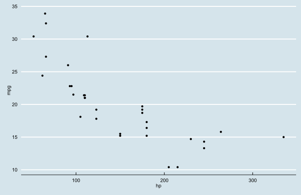

## Objectives

1. Review data visualization principles
2. Look at applications in education data
3. Challenges in an LEA/SEA
4. Best practices and advice
5. What tools to use


--- plot

### Example


```r
qplot(hp, mpg, data = mtcars) + theme_dpi()
```


--- &twocol w1:20% w2:80%

## Principles

*** left
- Chart Types and Data Types
- Dimensionality
- Scale
- Complexity
- Technical details
- Beyond charts

*** right


---

### Data Types

Level of Meas.   Stats
--------------- -----------------------------------------------
Nominal           mode, Chi-squared
Ordinal           median, percentile
Interval          mean, std. deviation, correlation, ANOVA
Continuous        geometric mean, harmonic mean, logarithms


Aesthetic       Discrete                 Continuous
----------  ---------------------------  --------------------------------
Color       Disparate colors             Sequential or divergent colors
Size        Unique size for each value   mapping to radius of value
Shape       A shape for each value       **does not make sense**

---

### Ordered vs. Unordered

Aesthetic  |    Ordered                         |  Unordered
---------- |  --------------------------------  |   -------------------------
Color      |  Sequential or divergent colors  |    Rainbow
Size       |  Increasing or decreasing radius |    **does not make sense**
Shape      |  **does not make sense**         |    A shape for each value


--- plot

### Example


--- &twocol w1:40% w2:60%

## My Header

*** left

- What to do?
- When the project?
- Is too big?

*** right

- Don't panic
- Relax
- Breathe

--- bg:url(img/badinfographic.png) bg-repeat: no-repeat

### Arbitrary image

--- quote

<p><q> Think like a <span class = 'red'>map</span>. Data density and easy interpretability.</q></p>

---

### Some tips

>- Focus on the content
>- Use best practices
>- Understand the limitations
>- Experiment and iterate!

---

### Charting Data

>- The type of data we look at determines the way it should be presented
>- It always starts with the data
>- Let's review the data types
>- Categorical
>- Ordinal
>- Interval
>- Continuous

--- plot

### Charting Categorical Data


--- plot

### Conditional 2


---

### Some tips

>- Have a properly chosen format and design 
>- Use words, numbers and drawing together
>- Reflect a balance, a proportion, relevant scale
>- Display an accessible complexity of details
>- Have a narrative quality, tell a story
>- Avoid content-free decoration (Tufte's proverbial chartjunk)
>- Draw in a professional manner with an eye on the technical details
>- Remember the map

--- plot

### Themes convey brands


```r
qplot(hp, mpg, data = mtcars) + theme_economist()
```




--- plot

### They Also Communicate


```r
qplot(hp, mpg, data = mtcars) + theme_tufte()
```


--- plot

### They Also Can Confound


```r
qplot(hp, mpg, data = mtcars, color = factor(cyl)) + theme_excel2003() + scale_color_excel2003()
```


--- plot

### So Choose Wisely


```r
qplot(hp, mpg, data = mtcars, color = factor(cyl)) + theme_stata()
```


---

### Stacked Bar

<p align="center"></p>

--- 

### Box and Whisker

<p align="center"></p>

---

### Bullet Chart

<p align="center"></p>


---

### Calendar

<p align="center"></p>

---

### Lines

<p align="center"></p>

---

### Parallel Coordinates

<p align="center"></p>

---

### Parallel Sets

<p align="center"></p>

---

### Streamgraph

<p align="center"></p>

---

### Tree Map

<p align="center"></p>

---

### Word Cloud

<p align="center"></p>


--- plot

### Ugly graphic

<script>
    function init() {

      var canvas = document.getElementById("canvas");
      var ctx = canvas.getContext("2d");

      draw(ctx);
    }

    function draw(ctx) {

      var gradient;

      // layer1/Path
      ctx.save();
      ctx.beginPath();
      ctx.moveTo(0.5, 0.0);
      ctx.lineTo(0.5, 423.0);
      ctx.stroke();

      // layer1/Path
      ctx.beginPath();
      ctx.moveTo(0.0, 423.5);
      ctx.lineTo(477.0, 423.5);
      ctx.stroke();

      // layer1/This is silly
      ctx.font = "36.0px 'Nyala'";
      ctx.fillText("This gradient is silly", 62.1, 93.3);

      // layer1/Path
      ctx.beginPath();
      ctx.moveTo(472.0, 317.0);
      ctx.lineTo(62.0, 317.0);
      ctx.lineTo(62.0, 175.0);
      ctx.lineTo(472.0, 175.0);
      ctx.lineTo(472.0, 317.0);
      ctx.closePath();
      gradient = ctx.createRadialGradient(267.0, 246.0, 0.0, 267.0, 246.0, 153.4);
      gradient.addColorStop(0.50, "rgb(255, 255, 255)");
      gradient.addColorStop(0.65, "rgb(255, 169, 171)");
      gradient.addColorStop(1.00, "rgb(255, 83, 88)");
      ctx.fillStyle = gradient;
      ctx.fill();
      ctx.restore();
    }
</script>

<body onload="init()">
   <canvas id="canvas" width="477" height="424"></canvas>
</body>

---

### Backmatter


```r
print(sessionInfo(), locale = FALSE)
```

```
R version 2.15.2 (2012-10-26)
Platform: x86_64-w64-mingw32/x64 (64-bit)

attached base packages:
[1] grid      stats     graphics  grDevices utils     datasets  methods  
[8] base     

other attached packages:
 [1] ggthemes_1.1.0  eeptools_0.1    mapproj_1.1-8.3 maps_2.2-8     
 [5] proto_0.3-9.2   plyr_1.8        ggplot2_0.9.3   stringr_0.6.2  
 [9] knitr_0.9.1     markdown_0.5.3  slidify_0.3.3   devtools_0.8   

loaded via a namespace (and not attached):
 [1] colorspace_1.2-0   dichromat_1.2-4    digest_0.6.0      
 [4] evaluate_0.4.3     formatR_0.7        gtable_0.1.2      
 [7] httr_0.2           labeling_0.1       MASS_7.3-22       
[10] memoise_0.1        munsell_0.4        parallel_2.15.2   
[13] RColorBrewer_1.0-5 RCurl_1.95-3       reshape2_1.2.2    
[16] scales_0.2.3       tools_2.15.2       whisker_0.1       
[19] yaml_2.1.5        
```


--- 

### References

- Tufte, Edward. 1992. [The Visual Display of Quantitative Information.](http://www.amazon.com/The-Visual-Display-Quantitative-Information/dp/0961392142/) Graphics Press. 
- Unwin, Theus, and Hofmann. 2006. [Graphics of Large Datasets: Visualizing a Million.](http://www.amazon.com/Graphics-Large-Datasets-Visualizing-Statistics/dp/0387329064) Springer. 
- Wilkinson, Leland. 2005. The Grammar of Graphics. Springer.
- Ware, Colin. 2012. [Information Visualization: Perception for Design.](http://www.amazon.com/Information-Visualization-Third-Edition-Technologies/dp/0123814642/ref=reg_hu-rd_add_1_dp) 3rd Edition. Morgan Kaufmann. 
- Cleveland, William. 1994. [The Elements of Graphing Data.](http://www.amazon.com/gp/product/0963488414/) Hobart Press. 
- Cleveland, William. 1993. [Visualizing Data.](http://www.amazon.com/gp/product/0963488406) Hobart Press.
- Few, Stephen. 2009. [Now You See It: Simple Visualization Techniques for Quantiative Analysis.](http://www.amazon.com/gp/product/0970601980/) Analytics Press. 
- Few, Stephen. 2012. [Show Me the Numbers: Designing Tables and Graphs to Enlighten.](http://www.amazon.com/gp/product/0970601972) Analytics Press. 
- Yau, Nathan. 2011. [Visualize This: The FlowingData Guide to Design, Visualization, and Statistics.](http://www.amazon.com/Visualize-This-FlowingData-Visualization-Statistics/dp/0470944889/) Wiley.
- Few, Stephen. 2006. [Information Dashboard Design: The Effective Visual Communication of Data.](http://www.amazon.com/Information-Dashboard-Design-Effective-Communication/dp/0596100167) O'Reilly Media


---


<p align="center"></p>
